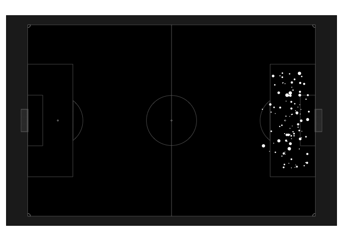

This tutorial will teach you how to make something like this -

## Prerequisites

You will need some familiarity with R - enough that you can copy paste
code and run it.

You need two libraries which aren’t on CRAN. You may need to run
`install.packages('devtools')` before you can install these two. Once
you have devtools available, CodaBonito can be installed by
`devtools::install_github('thecomeonman/CodaBonito')`. Similarly,
`devtools::install_github('thecomeonman/POV')` should install POV or
might error out because it needs the png package in which case run
`install.packages('png')` and then run
`devtools::install_github('thecomeonman/POV')` again.
`install.packages(c('data.table','ggplot2'))` should install the other
two libraries this tutorial needs.

## Notes

I see 3D visualisations gradually becoming more common. A lot of them
are just gimmicks but some of them are useful, because they offer a
perspective of the pitch that the viewer is more familiar with and is
able to grasp more comfortably rather than looking at a 2D pitch top
down. I’ve had many ( ~5 ) people ask me how to make the 3D xG maps I
had posted around September 2020
[here](https://twitter.com/thecomeonman/status/1295708685503565824) and
figured it’s high time I put a tutorial together.

I don’t usually write tutorials because I don’t have the patience for
it, which is also why I haven’t written this one for so long. Everything
you dislike about the tutorial can be attributed to that. Hopefully it
still makes sense to you and is useful though.

If there are bits you think can do with some more explaining then you can
tweet to me [here](https://twitter.com/thecomeonman/status/1576181043144511489).

## Tutorial

    rm(list = ls())

    library(CodaBonito)
    library(POV)
    library(data.table)
    library(ggplot2)

Just a simple 2D pitch.

    # pitch dimensions assuming centre circle at 0,0
    nXLimit = 60
    nYLimit = 40

    # plot
    p00100 = ggplot() +
       geom_pitch(
          nXStart = -nXLimit,
          nXEnd = nXLimit,
          nYStart = -nYLimit,
          nYEnd = nYLimit
       )

    print(p00100)

A simple 2D pitch but slightly different looking than the earlier plain
one.

    # pitch aesthetics
    cPitchColour = '#000000'
    cLineColour = '#666666'
    # no stripes - easier to see xG without it
    iXStripes = 0
    iYStripes = 0

    # thickness of lines on the plot
    # ggplot's preview and what it saves may not be similar so you may need
    # to save the image and see it and come back and adjust it iteratively
    nLineSize = 0.3

    # plot
    p00200 = ggplot() +
       geom_pitch(
          nXStart = -nXLimit,
          nXEnd = nXLimit,
          nYStart = -nYLimit,
          nYEnd = nYLimit,
          cPitchColour = cPitchColour,
          cLineColour = cLineColour,
          iXStripes = iXStripes,
          iYStripes = iYStripes,
          nSize = nLineSize
       )

    print(p00200)

Some other comsetic details about the plot.

    # other aesthetics around the pitch
    # non-pitch will have a  slightly different shade from the pitch
    # enough to be different but not enough to be jarring
    cBackgroundColour = '#222222'

    # plot
    p00300 = p00200 +
       # shortcut to remove the markings on the axis, etc. for a neater look
       theme_pitch() +
       theme(
          panel.background = element_rect(fill = cBackgroundColour)
       )

    # fixing aspect ratio
    p00300 = p00300 +
       coord_fixed()

    print(p00300)

3D-ifying the pitch. Note how the goal frames are sort of poking out
above the pitch now.

This would look the same as the 2D pitch if `mOriginCoordinates` were
set to `cbind(0,0,infinity)`or more practically a very very large value
on the z coordinate.

    # where are you viewing from / where is the camera located in x,y,z
    # this is at the centre of one of the goals (-60,0), and 50 units high
    mOriginCoordinates = cbind(0,0,50)
    # which way is up. explained in the coming sections
    mVectorPointingUpOnScreen = cbind(0,1,0)
    # where are you viewing at
    # this is the centre of the pitch, 0 units high.
    mViewCenteredAt = cbind(0,0,0)
    # hard to explain this so just leave it as is for now
    nScreenToOriginDistanceFactor = 10

    # calculating screen coordinates
    mVectorPointingToScreen = mViewCenteredAt - mOriginCoordinates
    mScreenCoordinates = ( ( mVectorPointingToScreen ) * nScreenToOriginDistanceFactor ) + mOriginCoordinates

    # plot
    p00333 = ggplot() +
       geom_pitch(
          nXStart = -nXLimit,
          nXEnd = nXLimit,
          nYStart = -nYLimit,
          nYEnd = nYLimit,
          cPitchColour = cPitchColour,
          cLineColour = cLineColour,
          iXStripes = iXStripes,
          iYStripes = iYStripes,
          nSize = nLineSize,
          mOriginCoordinates = mOriginCoordinates,
          mScreenCoordinates = mScreenCoordinates,
          mVectorPointingUpOnScreen = mVectorPointingUpOnScreen
       ) +
       theme_pitch() +
       coord_fixed() +
       theme(
          panel.background = element_rect(fill = cBackgroundColour)
       )

    print(p00333)

3D-ifying the pitch with the right view.

Note how the defending goal frame looks weird and stretched out. If you
were hovering right above the goal line, you’d see just the goal post,
not see the goal line, and then see the goal net stretching out under
and behind you. That’s what is happening here just that it doesn’t feel
like the goal net is behind.

    # this is at the centre of one of the goals (-60,0), and 50 units high
    mOriginCoordinates = cbind(-nXLimit,0,50)
    mVectorPointingUpOnScreen = cbind(0,0,1)
    # the centre of the other goal ( 60,0 ) at ground level ie 0 units high
    mViewCenteredAt = cbind(60,0,0)
    # hard to explain this so just leave it as is for now
    nScreenToOriginDistanceFactor = 10

    # calculating screen coordinates
    mVectorPointingToScreen = mViewCenteredAt - mOriginCoordinates
    mScreenCoordinates = ( ( mVectorPointingToScreen ) * nScreenToOriginDistanceFactor ) + mOriginCoordinates

    # plot
    p00366 = ggplot() +
       geom_pitch(
          nXStart = -nXLimit,
          nXEnd = nXLimit,
          nYStart = -nYLimit,
          nYEnd = nYLimit,
          cPitchColour = cPitchColour,
          cLineColour = cLineColour,
          iXStripes = iXStripes,
          iYStripes = iYStripes,
          nSize = nLineSize,
          mOriginCoordinates = mOriginCoordinates,
          mScreenCoordinates = mScreenCoordinates,
          mVectorPointingUpOnScreen = mVectorPointingUpOnScreen
       ) +
       theme_pitch() +
       coord_fixed() +
       theme(
          panel.background = element_rect(fill = cBackgroundColour)
       )

    print(p00366)

3D-ifying the pitch with the right view and reducing the area of view

    # given the origin coordinates in this tutorial, this will show only the 
    # last 3rd of the pitch and cut out the first 5/6 of the pitch
    mViewBeginsFromCoordinates = cbind(nXLimit*1/3,0,0)

    # plot
    p00400 = ggplot() +
       geom_pitch(
          nXStart = -nXLimit,
          nXEnd = nXLimit,
          nYStart = -nYLimit,
          nYEnd = nYLimit,
          cPitchColour = cPitchColour,
          cLineColour = cLineColour,
          iXStripes = iXStripes,
          iYStripes = iYStripes,
          nSize = nLineSize,
          mOriginCoordinates = mOriginCoordinates,
          mScreenCoordinates = mScreenCoordinates,
          mVectorPointingUpOnScreen = mVectorPointingUpOnScreen,
          mViewBeginsFromCoordinates = mViewBeginsFromCoordinates
       ) +
       theme_pitch() +
       coord_fixed() +
       theme(
          panel.background = element_rect(fill = cBackgroundColour)
       )

    print(p00400)

Adding shot data in 2D. We can’t see the legend but we don’t care for
that as you’ll see in the later sections.

    # now we'll add some shot data
    # input data
    # if you do indeed have data then put the right file name and change the
    # if ( F ) to if ( T )
    # otherwise there is some random data in case you don't have any
    # which you should comment out if you actually have data
    if ( F ) {

       your_file_path = ''
       dt_shots = fread(your_file_path)
       # ... and rename the columns so that the code can work with the data
       # replace the question marks with the respective columns in your data
       setnames(
          dt_shots,
          c('?','?','?','?','?','?'),
          c('x','y','xg','goal_y','goal_z','goal'),
          skip_absent = T
       )
       dt_shots[, goal := as.logical(goal)]

    } else {
       
       # randomly generating some shot data for a sample
       # set.seed(0)
       nbr_shots = 100
       dt_shots = data.table(
          x = 0.98*nXLimit - (rbeta(runif(nbr_shots), shape1 = 3, shape2 = 5) * nXLimit*25/60),
          y = sample(seq(-nYLimit/2,nYLimit/2,0.1),nbr_shots,replace = T),
          xg = rbeta(runif(nbr_shots), shape1 = 1, shape2 = 5),
          goal_y = rnorm(nbr_shots,sd = nYLimit/10),
          goal_z = runif(100) * nYLimit/10
       )
       
       dt_shots[, shot_id := .I]
       
       # ramdoly marking goals and non-goals
       # using some more or less correct values for the span of the goal frame
       # to make only on target shots as goals
       # you can also get the actual coords of the goal frame from CodaBonito
       # but that's beyond the scope of this tutorial
       dt_shots[, goal := ( abs(goal_y) < (nYLimit/10) ) & goal_z < (nYLimit/15)]
       dt_shots[goal == T, goal := shot_id %in% sample(shot_id, dt_shots[,round(.N*mean(xg))])]

    }

    # as per your data, if you have goalmouth coords available
    bGoalmouthCoordsAvailable = T
    shot_colour = 'white'

    # adding a unique identifier for each shot
    if ( !'shot_id' %in% colnames(dt_shots) ) {
       dt_shots[, shot_id := .I]
    }

    # plot
    p00500 = p00300 +
       geom_point(
          data = dt_shots,
          aes(x = x, y = y, size = xg),
          # size = 5,
          color = shot_colour
       )

    print(p00500)

Converting the shot points to shot circles.

    # attributes of the circles around the shots instead of mapping the size
    # aspect directly through the ggplot functionality
    xg_to_radius = 1 # circle radius scaling factor based on xg
    shot_circle_resolution = 20 # we'll draw a polygon of so many sides instead of a cricle

    # function to create a circle around a point
    fGetCircle = function(
       centre_x,
       centre_y,
       radius,
       resolution
    ) {
       
       list(
          centre_x + ( radius * sin(seq(0,2*pi,2*pi/resolution)) ),
          centre_y + ( radius * cos(seq(0,2*pi,2*pi/resolution)) )
       )
       
    }

    # creating circle around shot
    dt_shots_circles_ground = dt_shots[, 
       fGetCircle(
          centre_x = x,
          centre_y = y,
          radius = xg * xg_to_radius,
          resolution = shot_circle_resolution
       ),
       list(x,y,shot_id,xg)
    ]

    # renaming the circle coordinaes
    setnames(
       dt_shots_circles_ground, 
       c('V1','V2'), 
       c('x_2d_plot','y_2d_plot')
    )

    # plot
    p00600 = p00300 +
       geom_polygon(
          data = dt_shots_circles_ground,
          aes(x = x_2d_plot, y = y_2d_plot, group = shot_id),
          # size = 5,
          fill = shot_colour,
          color = shot_colour
       )

    print(p00600)

3D-ifying the shot circles.

    # Doing the 3d perspective of the shot circles on the ground as well
    dt_shots_circles_ground = rbindlist(lapply(
       dt_shots[, shot_id],
       function(shot_id_counter) {

          dt_shots_circles_subset = dt_shots_circles_ground[
             shot_id == shot_id_counter
          ]
       
          # this is the function that does the 3d transformation
          # everything else is just adding more columns etc
          dtTransformedCoordinates = fGetTransformedCoordinates(
             mCoordinates = dt_shots_circles_subset[, cbind(x_2d_plot, y_2d_plot, 0)],
             mOriginCoordinates = mOriginCoordinates,
             mScreenCoordinates = mScreenCoordinates,
             mVectorPointingUpOnScreen = mVectorPointingUpOnScreen,
             mViewBeginsFromCoordinates = mViewBeginsFromCoordinates,
             iTreatAs = 3
          )

          dtTransformedCoordinates = data.table(dtTransformedCoordinates)

          setnames(
             dtTransformedCoordinates,
             c('x','y'),
             c('x_3d_plot','y_3d_plot')
          )

          # keeping the corresponding 2d coords
          dtTransformedCoordinates[,
                                   c('x_2d_plot', 'y_2d_plot') := dt_shots_circles_subset[
                                      inputOrder,
                                      list(x_2d_plot, y_2d_plot)
                                   ]
          ]

          dtTransformedCoordinates[,
                                   c('shot_id','x','y','xg','goal') := dt_shots[
                                      shot_id == shot_id_counter, 
                                      list(shot_id,x,y,xg,goal)
                                   ]
          ]

          dtTransformedCoordinates

       }

    ))

    # plot
    p00700 = p00400 +
       geom_polygon(
          data = dt_shots_circles_ground,
          aes(
             x = x_3d_plot,
             y = y_3d_plot,
             group = shot_id
          ),
          fill = shot_colour,
          color = shot_colour
       )

    print(p00700)

Some more cosmetic details of the shots.

    # more aesthetics of the shots
    # transparency of the circles. With higher number of shots
    # you should lower this value even more, and v.v.
    shot_alpha = 0.1 
    goal_colour = 'red'

    # plot
    p00800 = p00400 +
       geom_polygon(
          data = dt_shots_circles_ground,
          aes(
             x = x_3d_plot,
             y = y_3d_plot,
             group = shot_id,
             fill = (goal),
             colour = (goal)
          ),
          alpha = shot_alpha
       ) +
       scale_fill_manual(
          values = c(shot_colour, goal_colour), 
          breaks = c(F,T),
          guide = F
       ) +
       scale_colour_manual(
          values = c(shot_colour, goal_colour), 
          breaks = c(F,T),
          guide = F
       )

    print(p00800)

Adding the shot’s goalmouth coordinates also if the data is available.

    # adding goalmouth location on the goalmouth with size, colour
    p00900 = p00800

    if ( bGoalmouthCoordsAvailable ) {

       # creating circles on the goalmouth
       dt_shots_circles_goalmouth = dt_shots[,
          fGetCircle(
             centre_x = goal_y,
             centre_y = goal_z,
             radius = xg * xg_to_radius,
             resolution = shot_circle_resolution
          ),
          list(goal_y,goal_z,shot_id,xg)
       ]
       
       setnames(
          dt_shots_circles_goalmouth, 
          c('V1','V2'), 
          c('goal_y_2d_plot','goal_z_2d_plot')
       )

       # creating 3d transforms of the circles
       dt_shots_circles_goalmouth = rbindlist(lapply(
          dt_shots[, shot_id],
          function(shot_id_counter) {

             dt_shots_circles_subset = dt_shots_circles_goalmouth[
                shot_id == shot_id_counter
             ]

             dtTransformedCoordinates = fGetTransformedCoordinates(
                mCoordinates = dt_shots_circles_subset[,
                                                       cbind(nXLimit, goal_y_2d_plot, goal_z_2d_plot)
                ],
                mOriginCoordinates = mOriginCoordinates,
                mScreenCoordinates = mScreenCoordinates,
                mVectorPointingUpOnScreen = mVectorPointingUpOnScreen,
                mViewBeginsFromCoordinates = mViewBeginsFromCoordinates,
                iTreatAs = 3
             )

             dtTransformedCoordinates = data.table(dtTransformedCoordinates)

             setnames(
                dtTransformedCoordinates,
                c('x','y'),
                c('x_3d_plot','y_3d_plot')
             )

             dtTransformedCoordinates[,
                                      c('goal_y_2d_plot', 'goal_z_2d_plot') := dt_shots_circles_subset[
                                         inputOrder,
                                         list(goal_y_2d_plot, goal_z_2d_plot)
                                      ]
             ]

             dtTransformedCoordinates[,
                                      c('shot_id','goal_y','goal_z','xg','goal') := dt_shots[shot_id == shot_id_counter, list(shot_id,goal_y,goal_z,xg,goal)]
             ]

             dtTransformedCoordinates

          }

       ))

       p00900 = p00900 + 
          geom_polygon(
             data = dt_shots_circles_goalmouth,
             aes(
                x = x_3d_plot,
                y = y_3d_plot,
                group = shot_id,
                fill = (goal),
                colour = (goal)
             ),
             alpha = shot_alpha
          )

       print(p00900)

    }

And connecting the line segment from the shot coordinates on the ground
to the shot coordinates on the goalmouth.

    # adding line segments connecting the shot xy and goalmouth yz
    p01000 = p00900

    if ( bGoalmouthCoordsAvailable ) {

       # calculating 3d line segment coords
       dt_shots = rbindlist(lapply(
          dt_shots[, shot_id],
          function(shot_id_counter) {

             dt_shots_circles_subset = dt_shots[
                shot_id == shot_id_counter
             ]

             mTransformedCoordinatesGround = fGetTransformedCoordinates(
                mCoordinates = dt_shots_circles_subset[, cbind(x, y, 0)],
                mOriginCoordinates = mOriginCoordinates,
                mScreenCoordinates = mScreenCoordinates,
                mVectorPointingUpOnScreen = mVectorPointingUpOnScreen,
                mViewBeginsFromCoordinates = mViewBeginsFromCoordinates,
                iTreatAs = 3
             )

             dt_shots_circles_subset[, x_3d_ground := mTransformedCoordinatesGround[, 'x']]
             dt_shots_circles_subset[, y_3d_ground := mTransformedCoordinatesGround[, 'y']]

             mTransformedCoordinatesGoal = fGetTransformedCoordinates(
                mCoordinates = dt_shots_circles_subset[, cbind(nXLimit, goal_y, goal_z)],
                mOriginCoordinates = mOriginCoordinates,
                mScreenCoordinates = mScreenCoordinates,
                mVectorPointingUpOnScreen = mVectorPointingUpOnScreen,
                mViewBeginsFromCoordinates = mViewBeginsFromCoordinates,
                iTreatAs = 3
             )

             dt_shots_circles_subset[, x_3d_goal := mTransformedCoordinatesGoal[, 'x']]
             dt_shots_circles_subset[, y_3d_goal := mTransformedCoordinatesGoal[, 'y']]

             dt_shots_circles_subset

          }

       ))

       # plot
       p01000 = p01000 +
          geom_segment(
             data = dt_shots,
             aes(
                x = x_3d_ground,
                y = y_3d_ground,
                xend = x_3d_goal,
                yend = y_3d_goal,
                colour = (goal)
             ),
             alpha = shot_alpha
          )

       print(p01000)

    }

Here’s one with just the goalmouth stuff, like how some goalkeeper
visualisations are.

    if ( bGoalmouthCoordsAvailable ) {
          
       # this is at the centre of one of the goals (-60,0), and 50 units high
       mOriginCoordinates2 = cbind(0.5*nXLimit,0,1)
       mVectorPointingUpOnScreen2 = cbind(0,0,1)
       # the centre of the other goal ( 60,0 ) at ground level ie 0 units high
       mViewCenteredAt2 = cbind(60,0,1)
       # hard to explain this so just leave it as is for now
       nScreenToOriginDistanceFactor2 = 10
       
       # calculating screen coordinates
       mVectorPointingToScreen2 = mViewCenteredAt2 - mOriginCoordinates2
       mScreenCoordinates2 = ( ( mVectorPointingToScreen2 ) * nScreenToOriginDistanceFactor2 ) + mOriginCoordinates2

       # given the origin coordinates in this tutorial, this will show only the 
       # last 3rd of the pitch and cut out the first 2/3rd of the pitch
       mViewBeginsFromCoordinates2 = cbind(nXLimit * 0.9,0,1)
       
       # calculating screen coordinates
       mVectorPointingToScreen2 = mViewCenteredAt2 - mOriginCoordinates2
       
       dt_shots_circles_goalmouth2 = dt_shots[,
                                             list(
                                                goal_y_2d_plot = sin(seq(0,2*pi,2*pi/shot_circle_resolution)),
                                                goal_z_2d_plot = cos(seq(0,2*pi,2*pi/shot_circle_resolution))
                                             ),
                                             list(goal_y,goal_z,shot_id,xg)
       ]

       dt_shots_circles_goalmouth2[, goal_y_2d_plot := ( goal_y_2d_plot * xg * xg_to_radius ) + goal_y]
       dt_shots_circles_goalmouth2[, goal_z_2d_plot := ( goal_z_2d_plot * xg * xg_to_radius ) + goal_z]

       # 3d-ifying 
       dt_shots_circles_goalmouth2 = rbindlist(lapply(
          dt_shots[, shot_id],
          function(shot_id_counter) {

             dt_shots_circles_subset = dt_shots_circles_goalmouth2[
                shot_id == shot_id_counter
             ]

             dtTransformedCoordinates = fGetTransformedCoordinates(
                mCoordinates = dt_shots_circles_subset[,
                                                       cbind(nXLimit, goal_y_2d_plot, goal_z_2d_plot)
                ],
                mOriginCoordinates = mOriginCoordinates2,
                mScreenCoordinates = mScreenCoordinates2,
                mVectorPointingUpOnScreen = mVectorPointingUpOnScreen2,
                mViewBeginsFromCoordinates = mViewBeginsFromCoordinates2,
                iTreatAs = 3
             )

             dtTransformedCoordinates = data.table(dtTransformedCoordinates)

             setnames(
                dtTransformedCoordinates,
                c('x','y'),
                c('x_3d_plot','y_3d_plot')
             )

             dtTransformedCoordinates[,
                                      c('goal_y_2d_plot', 'goal_z_2d_plot') := dt_shots_circles_subset[
                                         inputOrder,
                                         list(goal_y_2d_plot, goal_z_2d_plot)
                                      ]
             ]

             dtTransformedCoordinates[,
                                      c('shot_id','goal_y','goal_z','xg','goal') := dt_shots[shot_id == shot_id_counter, list(shot_id,goal_y,goal_z,xg,goal)]
             ]

             dtTransformedCoordinates

          }

       ))

       # plot
       p01100 = ggplot() +
          geom_pitch(
             nXStart = -nXLimit,
             nXEnd = nXLimit,
             nYStart = -nYLimit,
             nYEnd = nYLimit,
             cPitchColour = cPitchColour,
             cLineColour = cLineColour,
             iXStripes = iXStripes,
             iYStripes = iYStripes,
             nSize = nLineSize,
             mOriginCoordinates = mOriginCoordinates2,
             mScreenCoordinates = mScreenCoordinates2,
             mVectorPointingUpOnScreen = mVectorPointingUpOnScreen2,
             mViewBeginsFromCoordinates = mViewBeginsFromCoordinates2,
             
          ) + 
          geom_polygon(
             data = dt_shots_circles_goalmouth2,
             aes(
                x = x_3d_plot,
                y = y_3d_plot,
                group = shot_id,
                fill = (goal),
                colour = (goal)
             ),
             alpha = shot_alpha
          ) +
          theme_pitch() +
          coord_fixed() +
          theme(
             panel.background = element_rect(fill = cBackgroundColour)
          ) +
          scale_fill_manual(
             values = c(shot_colour, goal_colour), 
             breaks = c(F,T),
             guide = F
          ) +
          scale_colour_manual(
             values = c(shot_colour, goal_colour), 
             breaks = c(F,T),
             guide = F
          )

       
       # you can comment out the theme_pitch line and 
       # see the coordinates and then decide on an appropriate
       # value for the xlim
       # you can also get the actual coords of the goalpost from CodaBonito
       # but that's beyond the scope of this tutorial
       # if there's no xlim then the entire base line of the pitch would
       # be plotted which would make the goalmouth very small
       # you could also calculate what these values would be with some
       # geometry but we'll take the lazier route for purpose of this
       # tutorial
       # this will throw a warning about the coord system being overriden though
       p01100 = p01100 + coord_fixed(xlim = c(-80,80))   
       
       print(p01100)
       
    }

    ## Coordinate system already present. Adding new coordinate system, which will replace the existing one.

We removed the legend earlier so we still need a legend. The 3d-ifying
things makes it a little hard to give a very precisely mappable legend
but we really need only indicators so the distorting is acceptable IMO.

Note that the text isn’t 3d-ified in this tutorial. There is a very
alpha version of a function in the POV library - fGetTextCoordinates,
which you are free to try out though.

    # Lots of stuff happening in this chunk but you've seen it all before so of course
    # you don't need any comments anymore

    dt_legend = data.table(
       goal_z = 3,
       xg = c(0.2,0.5,0.8),
       goal = T
    )[, shot_id := .I]

    dt_legend = dt_legend[order(xg)]
    dt_legend[, goal_y := 20 + ( 1.2 * ( 2 * xg_to_radius * .I ) )]
    # dt_legend[, goal_y := 20 + ( 2.5 * ( 2 * xg_to_radius * cumsum(xg) ) )]

    dt_legend_circles_goalmouth = dt_legend[,
      fGetCircle(
         centre_x = goal_y,
         centre_y = goal_z,
         radius = xg * xg_to_radius,
         resolution = shot_circle_resolution
      ),
      list(goal_y,goal_z,shot_id,xg)
    ]

    setnames(
       dt_legend_circles_goalmouth, 
       c('V1','V2'), 
       c('goal_y_2d_plot','goal_z_2d_plot')
    )

    dt_legend_circles_goalmouth = rbindlist(lapply(
       dt_legend[, shot_id],
       function(shot_id_counter) {
          
          dt_legend_circles_subset = dt_legend_circles_goalmouth[
             shot_id == shot_id_counter
          ]
          
          dtTransformedCoordinates = fGetTransformedCoordinates(
             mCoordinates = dt_legend_circles_subset[, cbind(nXLimit, goal_y_2d_plot, goal_z_2d_plot)],
             mOriginCoordinates = mOriginCoordinates,
             mScreenCoordinates = mScreenCoordinates,
             mVectorPointingUpOnScreen = mVectorPointingUpOnScreen,
             mViewBeginsFromCoordinates = mViewBeginsFromCoordinates,
             iTreatAs = 3
          )
          
          dtTransformedCoordinates = data.table(dtTransformedCoordinates)
          
          setnames(
             dtTransformedCoordinates,
             c('x','y'),
             c('x_3d_plot','y_3d_plot')
          )
          
          dtTransformedCoordinates[,
                                   c('goal_y_2d_plot', 'goal_z_2d_plot') := dt_legend_circles_subset[
                                      inputOrder,
                                      list(goal_y_2d_plot, goal_z_2d_plot)
                                   ]
          ]
          
          dtTransformedCoordinates[,
                                   c('shot_id','goal_y','goal_z','xg','goal') := dt_legend[shot_id == shot_id_counter, list(shot_id,goal_y,goal_z,xg,goal)]
          ]
          
          dtTransformedCoordinates
          
       }
       
    ))

    dt_legend = rbindlist(lapply(
       dt_legend[, shot_id],
       function(shot_id_counter) {
          
          dt_legend_circles_subset = dt_legend[
             shot_id == shot_id_counter
          ]
          
          mTransformedCoordinatesGoal = fGetTransformedCoordinates(
             mCoordinates = dt_legend_circles_subset[, cbind(nXLimit, goal_y, goal_z + (nYLimit/15))],
             mOriginCoordinates = mOriginCoordinates,
             mScreenCoordinates = mScreenCoordinates,
             mVectorPointingUpOnScreen = mVectorPointingUpOnScreen,
             mViewBeginsFromCoordinates = mViewBeginsFromCoordinates,
             iTreatAs = 3
          )
          
          dt_legend_circles_subset[, x_3d_goal_text := mTransformedCoordinatesGoal[, 'x']]
          dt_legend_circles_subset[, y_3d_goal_text := mTransformedCoordinatesGoal[, 'y']]
          
          
          dt_legend_circles_subset
          
       }
       
    ))

    p01200 = p01000 + 
       geom_polygon(
          data = dt_legend_circles_goalmouth,
          aes(
             x = x_3d_plot,
             y = y_3d_plot,
             group = shot_id,
             fill = goal,
             colour = goal
          ),
          alpha = shot_alpha
       ) + 
       geom_text(
          data = dt_legend,
          aes(
             x = x_3d_goal_text,
             y = y_3d_goal_text,
             label = xg,
             color = goal
          ),
          size = 2
       )

    print(p01200)

This is still a regular ggplot so you can use regular ggplot
functionality to add more things to this, eg. you could add the name of
the player you’re analysing with a `geom_text` label or add a credit to
“thecomeonman/POV” in your caption with a
`labs(caption = 'Made using thecomeonman/POV')` :).
